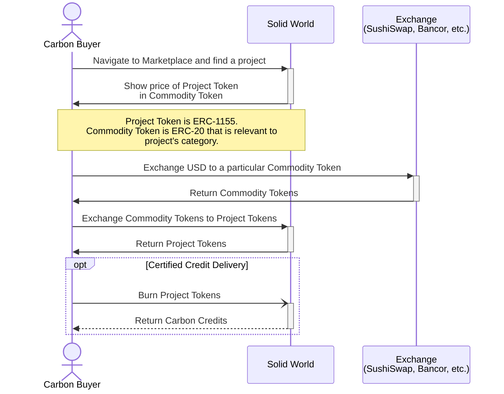

```mermaid
sequenceDiagram
  actor CB as Carbon Buyer
  participant SW as Solid World
  participant AMM as Exchange<br>(SushiSwap, Bancor, etc.) 

  CB->>+SW: Navigate to Marketplace and find a project
  SW->>-CB: Show price of Project Token<br>in Commodity Token
  Note over CB,SW: Project Token is ERC-1155.<br>Commodity Token is ERC-20 that is relevant to<br> project's category.

  CB->>+AMM: Exchange USD to a particular Commodity Token
  AMM->>-CB: Return Commodity Tokens

  CB->>+SW: Exchange Commodity Tokens to Project Tokens
  SW->>-CB: Return Project Tokens

  opt Certified Credit Delivery
    CB-)+SW: Burn Project Tokens
    SW-->>-CB: Return Carbon Credits  
  end
```
