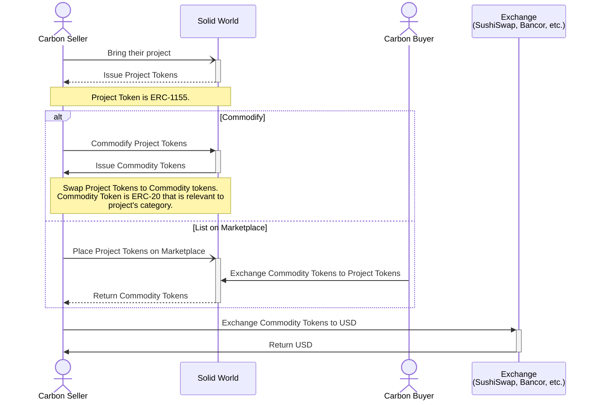

```mermaid
sequenceDiagram
  actor CP as Carbon Seller
  participant SW as Solid World
  actor CB as Carbon Buyer
  participant AMM as Exchange <br>(SushiSwap, Bancor, etc.) 

  CP-)+SW: Bring their project
  SW-->>-CP: Issue Project Tokens
  Note over CP,SW: Project Token is ERC-1155.
  
  alt Commodify
    CP->>+SW: Commodify Project Tokens
    SW->>-CP: Issue Commodity Tokens
    Note over CP,SW: Swap Project Tokens to Commodity tokens.<br>Commodity Token is ERC-20 that is relevant to <br> project's category.
  else List on Marketplace
    CP-)+SW: Place Project Tokens on Marketplace
    CB->>SW: Exchange Commodity Tokens to Project Tokens
    SW-->>-CP: Return Commodity Tokens
  end

  CP->>+AMM: Exchange Commodity Tokens to USD
  AMM->>-CP: Return USD


```
