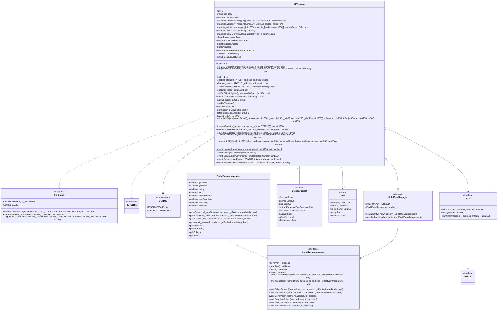

```mermaid
classDiagram
    CTTreasury ..|> SolidMath
    CTTreasury ..|> IERC1155
    CTTreasury --* STATUS
    CTTreasury --|> SolidDaoManaged
    CTTreasury "1" --> "*" CarbonProject
    CTTreasury "1" --> "*" Order
    CTTreasury "1" --> "1" ICT
    SolidDaoManagement ..|> ISolidDaoManagement
    SolidDaoManaged "1" --> "1" ISolidDaoManagement
    ICT --|> IERC20

    class CTTreasury{
      +ICT CT
      +string category
      +uint256 totalReserves
      +mapping[address=>mapping[uint256=>CarbonProject]] carbonProjects
      +mapping[address=>mapping[uint256=>uint256]] carbonProjectTons
      +mapping[address=>mapping[uint256=>mapping[address=>uint256]]] carbonProjectBalances
      +mapping[STATUS=>address[]] registry
      +mapping[STATUS=>mapping[address=>bool]] permissions
      +Order[] permissionOrder
      +uint256 blocksNeededForOrder
      +bool timelockEnabled
      +bool initialized
      +uint256 onChainGovernanceTimelock
      +address DAOTreasury
      +uint256 daoLiquidityFee
      +initialize()
      +createOrUpdateCarbonProject(_carbonProject: CarbonProject) bool
      +depositReserveToken(_token: address, _tokenId: uint256, _amount: uint256, _owner: address) bool
      +sell() bool
      +enable(_status: STATUS, _address: address) bool
      +disable(_status: STATUS, _address: address) bool
      +orderTimelock(_status: STATUS, _address: address) bool
      +execute(_index: uint256) bool
      +setDAOLiquidityFee(_daoLiquidityFee: uint256) bool
      +setDAOAddress(_daoAddress: address) bool
      +nullify(_index: uint256) bool
      +enableTimelock()
      +disableTimelock()
      +permissionToDisableTimelock()
      +totalPermissionOrder() uint256
      +baseSupply() uint256
      +simulateDepositWeekPeriod(_numWeeks: uint256, _rate: uint256, _totalToken: uint256, _daoFee: uint256) (basisValue: uint256, toProjectOwner: uint256, toDAO: uint256)
      +indexInRegistry(_address: address, _status: STATUS) (bool, uint256)
      +onERC1155Received(address, address, uint256, uint256, bytes) bytes4
      +onERC1155BatchReceived(address, address, uint256[], uint256[], bytes) bytes4
      ~event Deposited(token: address, tokenId: uint256, owner: address, amount: uint256)
      ~event Sold(offerId: uint256, token: address, tokenId: uint256, owner: address, buyer: address, amount: uint256, totalValue: uint256)$
      ~event UpdatedInfo(token: address, tokenId: uint256, isActive: bool)$
      ~event ChangedTimelock(timelock: bool)
      ~event SetOnChainGovernanceTimelock(blockNumber: uint256)
      ~event Permissioned(status: STATUS, token: address, result: bool)
      ~event PermissionOrdered(status: STATUS, token: address, index: uint256)
    }

    class CarbonProject {
      <<struct>>
      token: address
      tokenId: uint256
      tons: uint256
      contractExpectedDueDate: uint256
      projectDiscountRate: uint256
      isActive: bool
      isCertified: bool
      isRedeemed: bool
    }

    class Order {
      <<struct>>
      managing: STATUS
      toPermit: address
      timelockEnd: uint256
      nullify: bool
      executed: bool
    }

    class STATUS {
      <<enumeration>>
      RESERVETOKEN: 0
      RESERVEMANAGER: 1
    }

        
    class SolidMath {
        <<Abstract>>
        +uint256 WEEKS_IN_SECONDS
        +uint256 BASIS
        +weeksInThePeriod(_initialDate: uint256, _contractExpectedDueDate: uint256) (bool, uint256)
        +calcBasicValue(_numWeeks: uint256, _rate: uint256) uint256
        +payout(_numWeeks: uint256, _totalToken: uint256, _rate: uint256, _daoFee: uint256) (uint256, uint256, uint256)
    } 
    
    class ICT {
        <<interface>>
        +mint(account_: address, amount_: uint256)
        +burn(amount: uint256)
        +burnFrom(account_: address, amount_: uint256)
    }
    
    class SolidDaoManaged {
        <<abstract>>
        +string UNAUTHORIZED 
        +ISolidDaoManagement authority
        +setAuthority(_newAuthority: ISolidDaoManagement)
        event AuthorityUpdated(authority: ISolidDaoManagement)
    }
    
    class ISolidDaoManagement {
        <<interface>>
        +governor() address
        +guardian() address
        +policy() address
        +vault() address
        event GovernorPushed(from: address, to: address, _effectiveImmediately: bool)
        event GuardianPushed(from: address, to: address, _effectiveImmediately: bool)
        event PolicyPushed(from: address, to: address, _effectiveImmediately: bool)
        event VaultPushed(from: address, to: address, _effectiveImmediately: bool)
        event GovernorPulled(from: address, to: address)
        event GuardianPulled(from: address, to: address)
        event PolicyPulled(from: address, to: address)
        event VaultPulled(from: address, to: address)
    }

    class SolidDaoManagement {
      +address governor
      +address guardian
      +address policy
      +address vault
      +address newGovernor
      +address newGuardian
      +address newPolicy
      +address newVault
      
      +pushGovernor(_newGovernor: address, _effectiveImmediately: bool)
      +pushGuardian(_newGuardian: address, _effectiveImmediately: bool)
      +pushPolicy(_newPolicy: address, _effectiveImmediately: bool)
      +pushVault(_newVault: address, _effectiveImmediately: bool)
      +pullGovernor()
      +pullGuardian()
      +pullPolicy()
      +pullVault()
    }
    
    class IERC20 {
        <<interface>>
    }
    
    class IERC1155 {
        <<interface>>
    }
```
