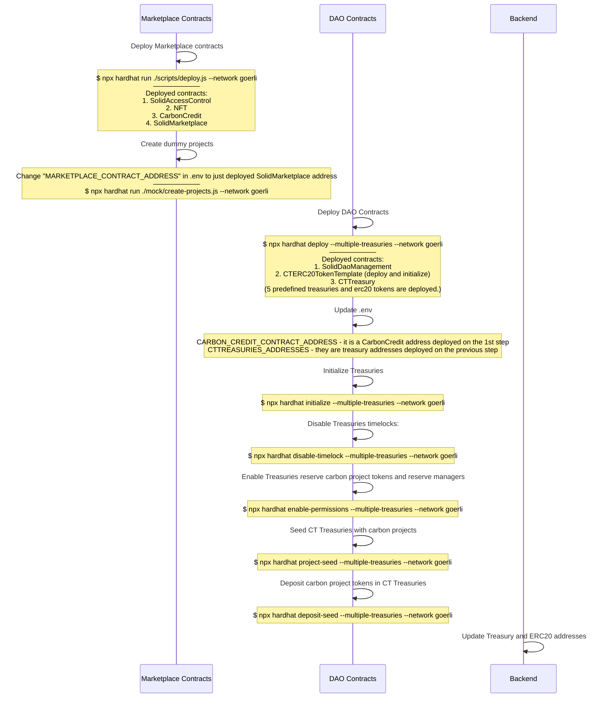

```mermaid
sequenceDiagram
    participant market as Marketplace Contracts
    participant dao as DAO Contracts
    participant Backend
    market->>market: Deploy Marketplace contracts
    Note over market: $ npx hardhat run ./scripts/deploy.js --network goerli <br>––––––––––––<br>Deployed contracts: <br>1. SolidAccessControl <br>2. NFT <br>3. CarbonCredit <br>4. SolidMarketplace
    market->>market: Create dummy projects
    Note over market: Change "MARKETPLACE_CONTRACT_ADDRESS" in .env to just deployed SolidMarketplace address<br>––––––––––––<br>$ npx hardhat run ./mock/create-projects.js  --network goerli
    dao->>dao: Deploy DAO Contracts
    Note over dao: $ npx hardhat deploy --multiple-treasuries --network goerli <br>––––––––––––<br>Deployed contracts: <br>1. SolidDaoManagement<br> 2. CTERC20TokenTemplate (deploy and initialize)<br> 3. CTTreasury<br> (5 predefined treasuries and erc20 tokens are deployed.)
    dao->>dao: Update .env
    Note over dao: CARBON_CREDIT_CONTRACT_ADDRESS - it is a CarbonCredit address deployed on the 1st step<br>CTTREASURIES_ADDRESSES - they are treasury addresses deployed on the previous step
    dao->>dao: Initialize Treasuries
    Note over dao: $ npx hardhat initialize --multiple-treasuries --network goerli
    dao->>dao: Disable Treasuries timelocks:
    Note over dao: $ npx hardhat disable-timelock --multiple-treasuries --network goerli
    dao->>dao: Enable Treasuries reserve carbon project tokens and reserve managers
    Note over dao: $ npx hardhat enable-permissions --multiple-treasuries --network goerli
    dao->>dao: Seed CT Treasuries with carbon projects
    Note over dao: $ npx hardhat project-seed --multiple-treasuries --network goerli
    dao->>dao: Deposit carbon project tokens in CT Treasuries
    Note over dao: $ npx hardhat deposit-seed --multiple-treasuries --network goerli
    Backend->>Backend: Update Treasury and ERC20 addresses
```
