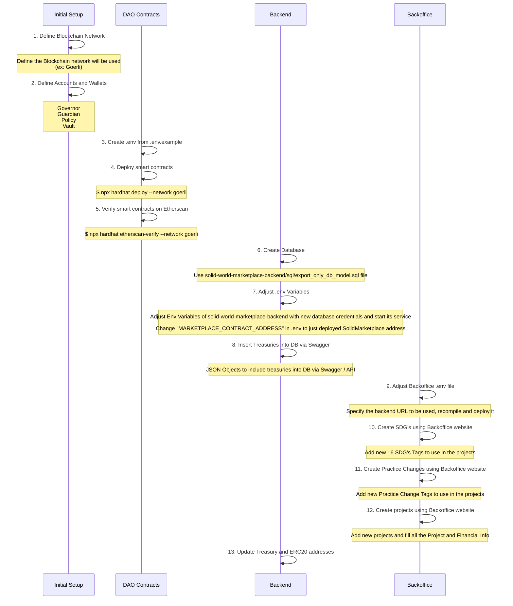

```mermaid
sequenceDiagram
    participant initialSetup as Initial Setup
    participant dao as DAO Contracts
    participant backend as Backend
    participant backoffice as Backoffice
    
    initialSetup->>initialSetup: 1. Define Blockchain Network
    Note over initialSetup: Define the Blockchain network will be used <br> (ex: Goerli)
    
    initialSetup->>initialSetup: 2. Define Accounts and Wallets
    Note over initialSetup: Governor <br> Guardian <br> Policy <br> Vault
    
    dao->>dao: 3. Create .env from .env.example
    
    dao->>dao: 4. Deploy smart contracts
    Note over dao: $ npx hardhat deploy --network goerli
    
    dao->>dao: 5. Verify smart contracts on Etherscan
    Note over dao: $ npx hardhat etherscan-verify --network goerli
        
    backend->>backend: 6. Create Database
    Note over backend: Use solid-world-marketplace-backend/sql/export_only_db_model.sql file
    
    backend->>backend: 7. Adjust .env Variables
    Note over backend: Adjust Env Variables of solid-world-marketplace-backend with new database credentials and start its service <br>––––––––––––<br> Change "MARKETPLACE_CONTRACT_ADDRESS" in .env to just deployed SolidMarketplace address
    
    backend->>backend: 8. Insert Treasuries into DB via Swagger
    Note over backend: JSON Objects to include treasuries into DB via Swagger / API
    
    backoffice->>backoffice: 9. Adjust Backoffice .env file
    Note over backoffice: Specify the backend URL to be used, recompile and deploy it
    
    backoffice->>backoffice: 10. Create SDG's using Backoffice website	
    Note over backoffice: Add new 16 SDG's Tags to use in the projects
    
    backoffice->>backoffice: 11. Create Practice Changes using Backoffice website	
    Note over backoffice: Add new Practice Change Tags to use in the projects
    
    backoffice->>backoffice: 12. Create projects using Backoffice website	
    Note over backoffice: Add new projects and fill all the Project and Financial Info
    
    backend->>backend: 13. Update Treasury and ERC20 addresses
    
```
