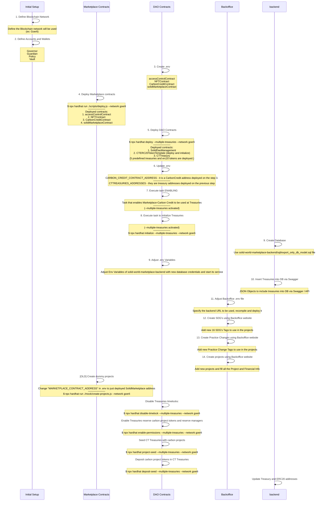

```mermaid
sequenceDiagram
    participant initialSetup as Initial Setup
    participant market as Marketplace Contracts
    participant dao as DAO Contracts
    participant backoffice as Backoffice
    participant backend
    
    initialSetup->>initialSetup: 1. Define Blockchain Network
    Note over initialSetup: Define the Blockchain network will be used <br> (ex: Goerli)
    
    initialSetup->>initialSetup: 2. Define Accounts and Wallets
    Note over initialSetup: Governor <br> Guardian <br> Policy <br> Vault
    
    dao->>dao: 3. Create .env
    Note over dao: accessControlContract <br>NFTContract <br>CarbonCreditContract <br>solidMarketplaceContract
    
    market->>market: 4. Deploy Marketplace contracts
    Note over market: $ npx hardhat run ./scripts/deploy.js --network goerli <br>––––––––––––<br>Deployed contracts: <br>1. accessControlContract <br>2. NFTContract <br>3. CarbonCreditContract <br>4. solidMarketplaceContract
    
    dao->>dao: 5. Deploy DAO Contracts
    Note over dao: $ npx hardhat deploy --multiple-treasuries --network goerli <br>––––––––––––<br>Deployed contracts: <br>1. SolidDaoManagement<br> 2. CTERC20TokenTemplate (deploy and initialize)<br> 3. CTTreasury<br> (5 predefined treasuries and erc20 tokens are deployed.)
    
    dao->>dao: 6. Update .env
    Note over dao: CARBON_CREDIT_CONTRACT_ADDRESS - it is a CarbonCredit address deployed on the step 3. <br>––––––––––––<br>CTTREASURIES_ADDRESSES - they are treasury addresses deployed on the previous step
    
    dao->>dao: 7. Execute task ENABLING
    Note over dao: Task that enables Marketplace-Carbon Credit to be used at Treasuries <br>––––––––––––<br>(--multiple-treasuries activated)
    
    dao->>dao: 8. Execute task to initialize Treasuries
    Note over dao: (--multiple-treasuries activated) <br>––––––––––––<br>$ npx hardhat initialize --multiple-treasuries --network goerli
    
    backend->>backend: 9. Create Database
    Note over backend: Use solid-world-marketplace-backend/sql/export_only_db_model.sql file
    
    dao->>dao: 9. Adjust .env Variables
    Note over dao: Adjust Env Variables of solid-world-marketplace-backend with new database credentials and start its service
    
    backend->>backend: 10. Insert Treasuries into DB via Swagger
    Note over backend: JSON Objects to include treasuries into DB via Swagger / API
    
    backoffice->>backoffice: 11. Adjust Backoffice .env file
    Note over backoffice: Specify the backend URL to be used, recompile and deploy it
    
    backoffice->>backoffice: 12. Create SDG's using Backoffice website	
    Note over backoffice: Add new 16 SDG's Tags to use in the projects
    
    backoffice->>backoffice: 13. Create Practice Changes using Backoffice website	
    Note over backoffice: Add new Practice Change Tags to use in the projects
    
    backoffice->>backoffice: 14. Create projects using Backoffice website	
    Note over backoffice: Add new projects and fill all the Project and Financial Info
    
    market->>market: [OLD] Create dummy projects
    Note over market: Change "MARKETPLACE_CONTRACT_ADDRESS" in .env to just deployed SolidMarketplace address<br>––––––––––––<br>$ npx hardhat run ./mock/create-projects.js  --network goerli
    
 
    
    dao->>dao: Disable Treasuries timelocks:
    Note over dao: $ npx hardhat disable-timelock --multiple-treasuries --network goerli
    
    dao->>dao: Enable Treasuries reserve carbon project tokens and reserve managers
    Note over dao: $ npx hardhat enable-permissions --multiple-treasuries --network goerli
    
    dao->>dao: Seed CT Treasuries with carbon projects
    Note over dao: $ npx hardhat project-seed --multiple-treasuries --network goerli
    
    dao->>dao: Deposit carbon project tokens in CT Treasuries
    Note over dao: $ npx hardhat deposit-seed --multiple-treasuries --network goerli
    
    backend->>backend: Update Treasury and ERC20 addresses
    
```
